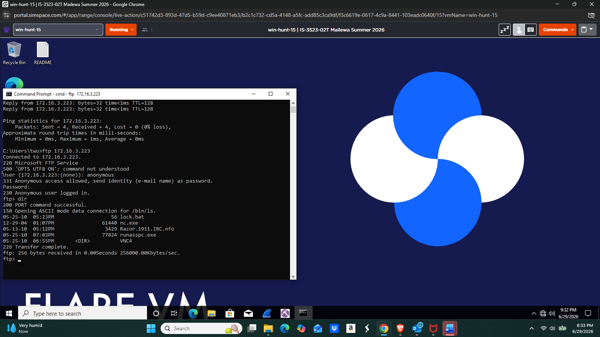

# FTP Server Compromise Investigation

External FTP enumeration and internal Windows XP triage correlating anonymous access, suspicious files, process evidence, and port checks.

**Author:** [Tenny Wu](https://github.com/714tenny)  
**Project type:** Academic lab / historical case study  
**Status:** Source work documented; scope and validation limits recorded below

## Context

Completed authorized academic investigation of `win-xp-13` at `172.16.3.223` on the ISCS-Security subnet.

## Tools

SimSpace, Windows XP, Windows investigation workstation, FTP client, PowerShell, Task Manager, netstat, msconfig

## Key results

- Confirmed anonymous login to Microsoft FTP Service and enumerated exposed files.
- Located Netcat, VNC-related files, `runaspc.exe`, `lock.bat`, and an IRC information file.
- Observed `poisonivy.exe` PID 1504 and correlated internal file paths and listening-port output.
- Recorded successful connectivity to TCP 6667 and failed checks for TCP 5900, 4444, 31337, and 12345.

## Documentation

- [Investigation notes](docs/investigation.md)
- [Sources and screenshot index](docs/source-and-evidence.md)
- [Commands](docs/commands.md)
- [Recorded indicators](indicators/observations.csv)

## Evidence preview

See the [evidence index](docs/source-and-evidence.md) for source-page references and the limits of each observation.

## Skills demonstrated

Service enumeration, Windows process triage, port validation, file-path investigation, evidence correlation, incident-response recommendations.

## Evidence boundaries

This repository presents authorized coursework and its recorded evidence. It does not represent a live production incident, newly validated remediation, or a deployed security product. Conclusions, uncertainties, and source discrepancies are documented in the investigation notes.
